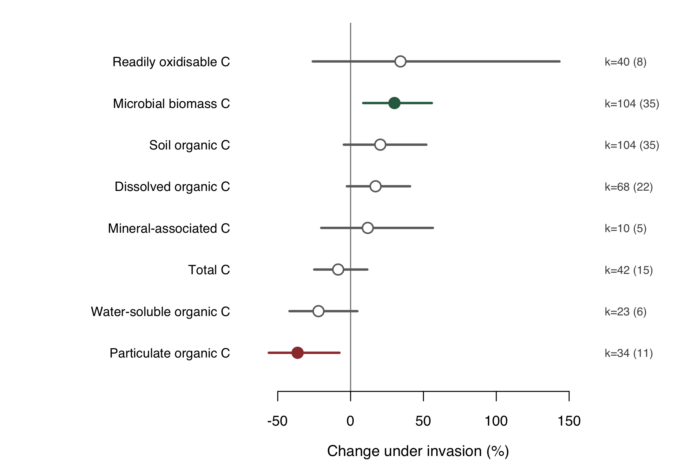
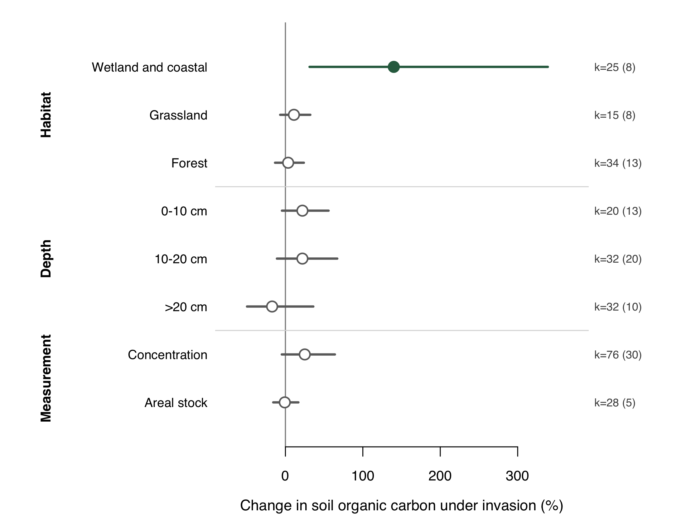
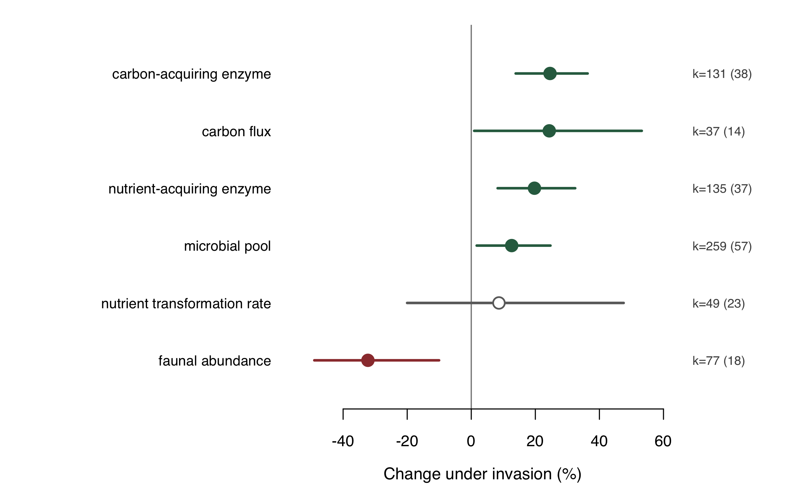
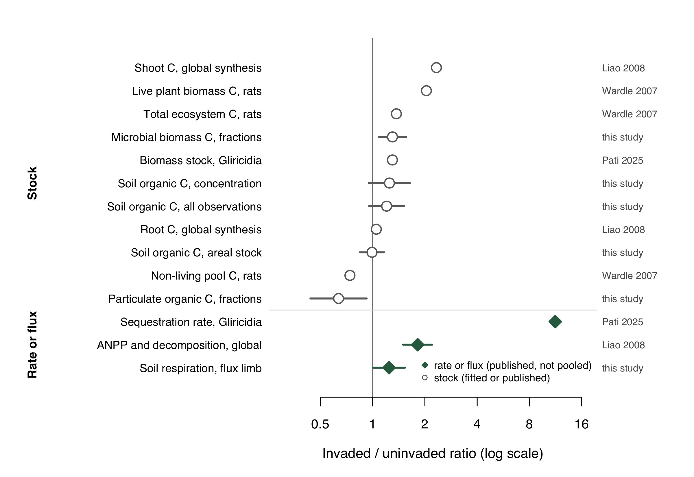
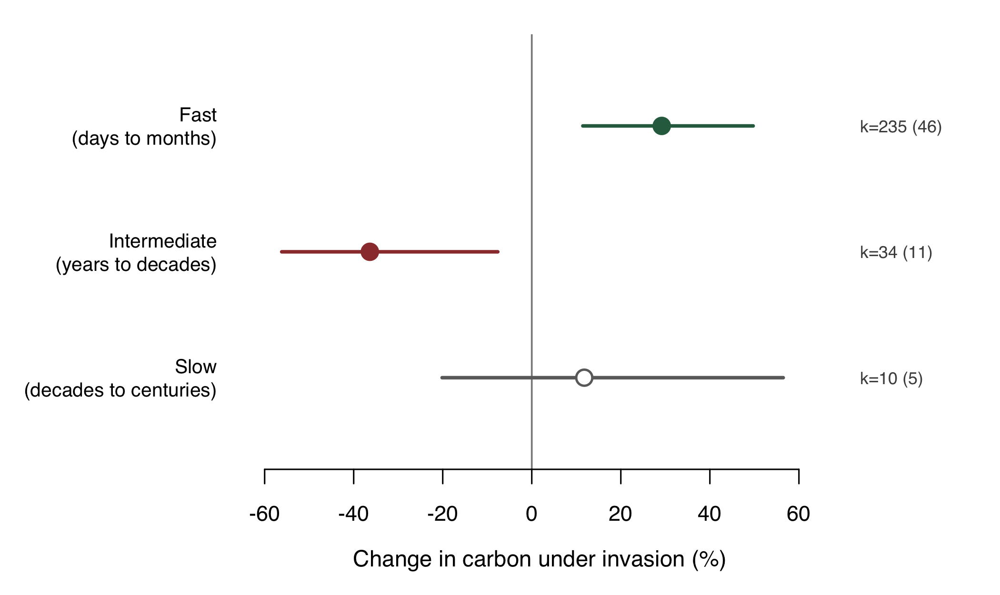

# Biological invasion increases carbon sequestration rates but not carbon stocks

Sole-authored manuscript for **Global Change Biology**, Research Article.
Master document: [`01.manuscript/invasion-rate-versus-stock.qmd`](01.manuscript/invasion-rate-versus-stock.qmd).

> **Rendering the manuscript runs the analysis.** Every model, table and figure below is
> computed when the document builds, from the two deposited datasets in `02.inputs/`, and every
> number in the prose is an inline R expression. There are no analysis scripts: if it is not in
> the manuscript, it is not part of the study. Nothing is fetched over the network.

```
cd 01.manuscript && quarto render invasion-rate-versus-stock.qmd --to docx
```

Requires R with `metafor`, `readxl` and `knitr`, plus Quarto. The two raw datasets are
gitignored and must be downloaded by hand; see [`02.inputs/README-data.md`](02.inputs/README-data.md).

---

## Abstract

Whether biological invasion increases ecosystem carbon storage is contested, and the disagreement has consequences for how invaded land is valued under carbon policy. We show that the contest is largely artefactual, arising because two different quantities are both reported as sequestration. Invasion raises the *rate* at which carbon moves through an ecosystem; it does not reliably raise the *stock* held there. These are the two methods the IPCC treats as equally valid for land carbon accounting, gain-loss and stock-difference, and on invaded land they disagree. We fit parallel meta-analyses of both quantities: 425 paired invaded and uninvaded observations from 57 studies across eight soil carbon fractions for stocks, and 688 paired observations from 110 sites in 25 countries for fluxes and related processes. Soil organic carbon was +20.4% higher under invasion but the interval spanned zero and the estimate fell to +6.8% under equal weighting. Among observations reporting carbon as an areal stock rather than a concentration the effect was -0.8%, 95% CI -15.7 to +16.7, and no contributing study reported the bulk density needed to convert between the two. Process rates moved in the opposite direction: soil respiration rose +24.3%, carbon-acquiring enzyme activity +24.6% and microbial biomass +12.6%, while soil fauna declined 32.3%. The gap between the flux and areal stock responses was +25.3 percentage points, in the predicted direction but not significant (*p* = 0.156). The strongest support is internal to the stock data, where the invasion effect declined with the turnover time of the pool, being largest in the fastest-cycling fractions; mineral-associated carbon was too sparsely measured to resolve. Carbon crediting rewards evidence of rate while paying for durable stock. Where the two diverge, as they do under invasion, that mismatch is a systematic source of over-crediting and a route to bio-perversity.

---

## Results, in the order the manuscript presents them

### Table 1. Published carbon accumulation rates (Methods 2.4)

Reproduced as published, tabulated and never pooled: four sources cannot support a pooled
estimate, and the entries differ in quantity and in units.

| Source | Invader | Trophic level | Quantity | Invaded | Uninvaded | Ratio |
|---|---|---|---|---|---|---|
| Pati 2025 | *Gliricidia sepium* | primary producer | carbon sequestration rate | 8.01 ± 1.5 | 0.71 ± 2.39 | 11.28 |
| Pati 2025 | *Gliricidia sepium* | primary producer | total biomass stock | 94.45 ± 10.27 | 72.85 ± 9.5 | 1.30 |
| Wardle 2007 | *Rattus spp* | predator | live plant biomass carbon | 104 | - | 2.04 |
| Wardle 2007 | *Rattus spp* | predator | non-living pool carbon | -26 | - | 0.74 |
| Wardle 2007 | *Rattus spp* | predator | total ecosystem carbon | 37 | - | 1.37 |
| Liao 2008 | multiple | primary producer | shoot carbon stock | 133 | - | 2.33 |
| Liao 2008 | multiple | primary producer | root carbon stock | 5 | - | 1.05 |
| Liao 2008 | multiple | primary producer | fluxes including ANPP and litter decomposition | 50 | - | 1.50 |
| Liao 2008 | multiple | primary producer | fluxes including ANPP and litter decomposition | 120 | - | 2.20 |

### Table 2. Pooled effect of invasion by soil carbon fraction (Results 3.1)

| Fraction | Obs. | Studies | Change (%) | CI low | CI high | p | I² (%) |
|---|---|---|---|---|---|---|---|
| SOC | 104 | 35 | +20.4 | -4.6 | +52.0 | 0.119 | 100 |
| TC | 42 | 15 | -8.5 | -25.0 | +11.5 | 0.377 | 99 |
| POC | 34 | 11 | -36.4 | -56.2 | -7.6 | 0.017 | 99 |
| MAOC | 10 | 5 | +11.8 | -20.1 | +56.5 | 0.516 | 100 |
| MBC | 104 | 35 | +30.1 | +8.7 | +55.8 | 0.004 | 99 |
| DOC | 68 | 22 | +17.2 | -2.5 | +40.8 | 0.092 | 100 |
| ROC | 40 | 8 | +34.2 | -26.0 | +143.4 | 0.332 | 100 |
| WSOC | 23 | 6 | -22.0 | -41.9 | +4.7 | 0.097 | 99 |

### Figure 1. Effect of invasion on eight soil carbon fractions



### Table 3. Moderator tests on soil organic carbon (Results 3.1)

| Moderator | Q<sub>M</sub> | df | p | Obs. |
|---|---|---|---|---|
| Soil depth (midpoint) | 3.76 | 1 | 0.053 | 84 |
| Habitat class | 13.68 | 3 | 0.003 | 76 |
| Invader growth cycle | 0.32 | 1 | 0.571 | 86 |
| Mean annual temperature | 0.39 | 1 | 0.530 | 46 |
| Mean annual precipitation | 0.37 | 1 | 0.542 | 56 |
| Basis of measurement | 0.55 | 1 | 0.460 | 104 |

### Figure 2. Soil organic carbon by habitat, depth and basis of measurement



### Table 4. Taxonomic concentration of the stock evidence (Results 3.1)

The pooled estimates are only as general as the studies behind them.

| Invasive taxon | Obs. | Share (%) | Studies |
|---|---|---|---|
| *Spartina alterniflora* | 38 | 36.5 | 10 |
| *Phyllostachys edulis* | 12 | 11.5 | 3 |
| *Chromolaena odorata* | 10 | 9.6 | 2 |
| *Ambrosia artemisiifolia* | 5 | 4.8 | 2 |
| *Sonneratia apetala* | 5 | 4.8 | 1 |
| *Robinia pseudoacacia* | 4 | 3.8 | 2 |
| *Bidens pilosa* | 3 | 2.9 | 1 |
| *Pueraria montana* | 3 | 2.9 | 1 |

### Table 5. Effect of invasion on soil processes, by functional class (Results 3.2)

Clustered by site, because the deposit carries no complete study identifier.

| Functional class | Obs. | Sites | Change (%) | CI low | CI high | p |
|---|---|---|---|---|---|---|
| carbon flux | 37 | 14 | +24.3 | +0.9 | +53.2 | 0.041 |
| nutrient transformation rate | 49 | 23 | +8.6 | -20.0 | +47.6 | 0.596 |
| nutrient-acquiring enzyme | 135 | 37 | +19.7 | +8.2 | +32.4 | < 0.001 |
| carbon-acquiring enzyme | 131 | 38 | +24.6 | +13.9 | +36.3 | < 0.001 |
| microbial pool | 259 | 57 | +12.6 | +1.7 | +24.7 | 0.022 |
| faunal abundance | 77 | 18 | -32.3 | -49.0 | -10.1 | 0.007 |

### Figure 6. Effect of invasion on soil processes



### Figure 4. The rate-stock divergence (Results 3.3)



### Table 6. Flux against stock, the formal contrast (Results 3.4)

The gap runs in the predicted direction and is largest against areal stock, which is the correct
comparison, but it does not reach significance. The manuscript reports this as a consistency
check the argument passes, not as a test it survives.

| Stock limb | Gap (pp) | Q_M | p | Stock obs |
|---|---|---|---|---|
| Areal stock (primary) | +25.3 | 2.01 | 0.156 | 28 |
| Concentration | +3.6 | 0.03 | 0.874 | 76 |
| All stock observations | +7.3 | 0.12 | 0.733 | 104 |

### Table 7. Sensitivity of the pooled soil organic carbon estimate (Results 3.6)

| Specification | Change (%) | 95% CI | Observations |
|---|---|---|---|
| Multilevel, imputation applied (primary) | +20.4 | -4.6 to +52.0 | 104 |
| Multilevel, reported dispersion only | +20.5 | -5.3 to +53.2 | 102 |
| Multilevel, observations weighted equally | +6.8 | -11.8 to +29.5 | 104 |
| Single-level random effects | +7.6 | -3.7 to +20.3 | 104 |

### Table 8. Effect of invasion by turnover class of the pool (Results 3.7)

Classes assigned a priori from published characterisations, before any model was fitted.

| Turnover class | Obs. | Studies | Change (%) | CI low | CI high | p |
|---|---|---|---|---|---|---|
| fast | 235 | 46 | +29.2 | +11.5 | +49.7 | < 0.001 |
| intermediate | 34 | 11 | -36.4 | -56.2 | -7.6 | 0.017 |
| slow | 10 | 5 | +11.8 | -20.1 | +56.5 | 0.516 |

### Figure 5. Effect of invasion by turnover class



---

## Repository layout

| Path | Contents |
|---|---|
| `01.manuscript/` | the master `.qmd`, the rendered `.docx`, and superseded drafts in `archive/` |
| `02.inputs/` | the two Dryad deposits, each with its own README, and the compiled rate evidence |
| `03.outputs/` | figures and tables written at render time; `archive/` holds outputs of the superseded version |
| `04.references/` | `references.bib`, the CSL style, and the literature PDFs (gitignored) |
| `05.tasks/` | study design notes and the evidence base |
| `CLAUDE.md` | working conventions, corrections already forced, and the traps |
| `INDEX.md` | what each file is and where it sits |

Figures and tables in `03.outputs/` are regenerated on every render and are committed because
they are what this README displays. The `.docx` is a build artefact; the `.qmd` is the source of
truth.
